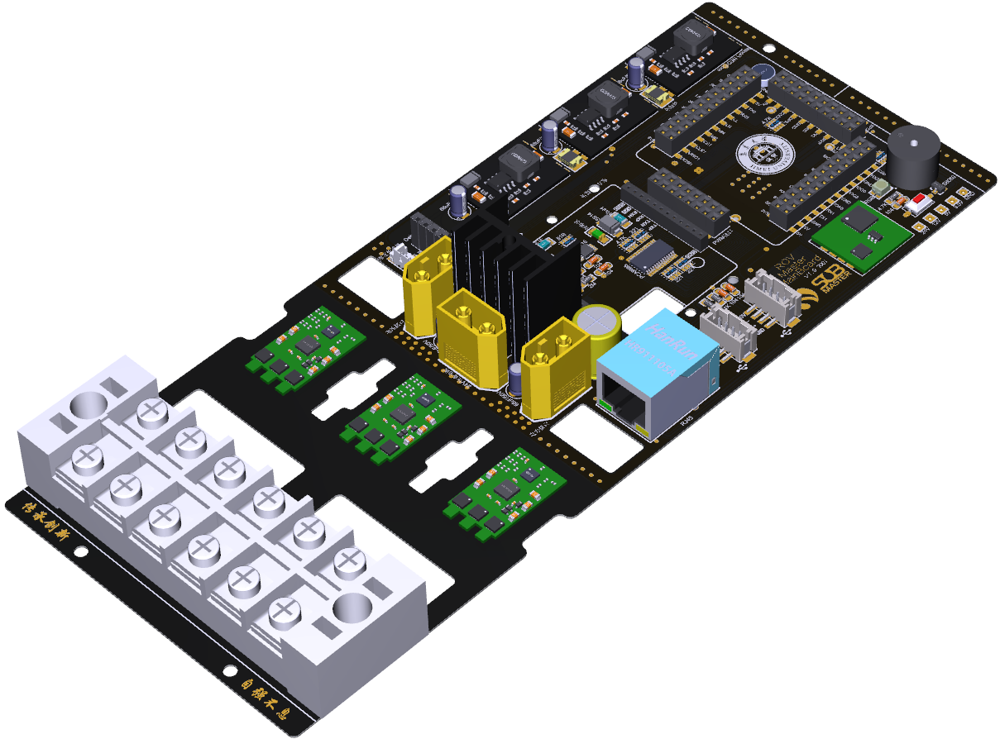

  

  
  

## 1.ROV Master 硬件说明

> 电源供电为DC300V，主板基于NanoPi NEO Core，外部扩展PWM、ADC

- (Powerboard in ROV 舱内电源板)[/Powerboard in ROV V1.0]
	- 为设备提供1500W电源输出
- (ROV Master Interface Board 接线板)[/ROV Master Interface Board V2.0]
	- 插入主板，用于给PWM设备信号线接入
- (ROV Master Mainboard 主板)[/ROV Master Mainboard V3.0]
	- 主控

- (MP1584 VRM 稳压电源模块3A)[/MP1584 VRM]

## 2.ROV Master 硬件进展

- [x] 主板设计
	- [x] 接线板 by [@Ian](https://github.com/zengwangfa)
    - [x] Rov Master主板 by [@Ian](https://github.com/zengwangfa)	
	- [x] 舱内电源板 by [@Ian](https://github.com/Hyf338)
---

- [x] 深度传感器
	- [x] MS5837 I2C版本 by [@Ian](https://github.com/zengwangfa)	
	- [x] SPL1301 I2C版本 by [@Ian](https://github.com/zengwangfa)		 
	- [ ] MS5837 UART自带解算版本
	- [ ] SPL1301 UART自带解算版本	

- [ ] 电调
	- [ ] 单向电调
	- [ ] 双向电调
	
- [ ] 9轴模块

- [ ] 水下监控摄像头

- [ ] 地面站

- [ ] 探照灯

- [ ] 舵机调试器	
	
- [ ] 稳压电源
	- [ ] AC-DC 稳压电源
	- [x] DC-DC 24V/3A 降压模块
	
	

	
#### 参与贡献
- Fork 本仓库
- 新建分支
- 提交
- 新建 Pull Request
- [点击联系我](Mailto:zengwangfa@outlook.com)